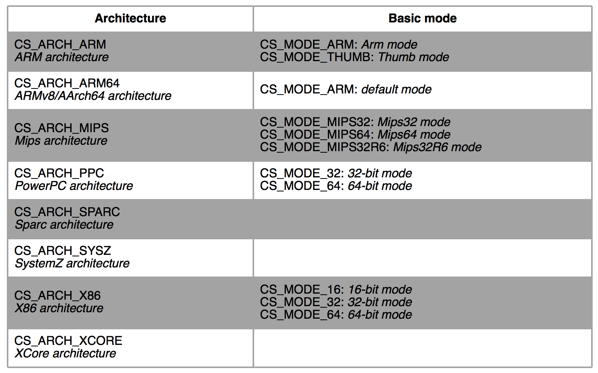
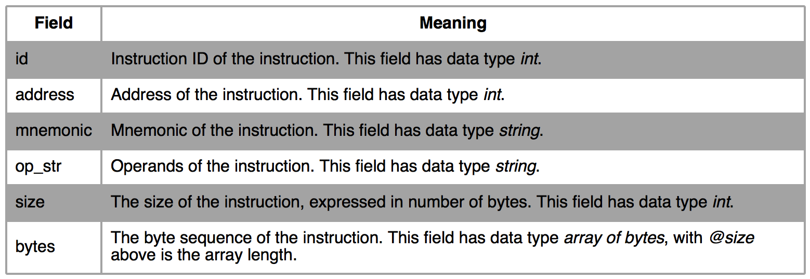

## Introduction
Capstone是一款轻量级反汇编引擎。它可以支持多种硬件构架，如ARM、ARM64、MIPS、X86。该框架使用C语言实现，但支持C++、Python、Ruby、OCaml、C#、Java和Go语言，具有很好的扩展性。
安装可参考以下链接：
http://www.capstone-engine.org/documentation.html

## Simple Sample
首先通过一个简单的例子来看下capstone的基本用法：
```python
from capstone import *

CODE = b"\x55\x48\x8b\x05\xb8\x13\x00\x00"

md = Cs(CS_ARCH_X86, CS_MODE_64)
for i in md.disasm(CODE, 0x1000):
    print("0x%x:\t%s\t%s" %(i.address, i.mnemonic, i.op_str))
```
首先用Cs类来初始化了一个反编译实例，该类需要两个参数，一个是硬件架构，另一个是硬件模式。可参考下图。

然后调用该类的disasm函数对二进制代码进行反汇编，该函数会返回一个CsInsn类，该类具有以下字段:

从2.1版本起提供了一个新的函数disasm_lite，跟disasm功能差不多，返回一个tuple（address, size, mnemonic, op_st）。

## Details
Cs类有个detial字段，当我们想要一些另外的重要的信息例如读写的寄存器或这些指令属于哪一个语义组，我们可以这样设置：
```python
md.detail = True
```
看下面的例子：
```python
from capstone import *
from capstone.arm import *

CODE = b"\xf1\x02\x03\x0e\x00\x00\xa0\xe3\x02\x30\xc1\xe7\x00\x00\x53\xe3"

md = Cs(CS_ARCH_ARM, CS_MODE_ARM)
md.detail = True

for i in md.disasm(CODE, 0x1000):
    if i.id in (ARM_INS_BL, ARM_INS_CMP):
        print("0x%x:\t%s\t%s" %(i.address, i.mnemonic, i.op_str))

        if len(i.regs_read) > 0:
            print("\tImplicit registers read: "),
            for r in i.regs_read:
                print("%s " %i.reg_name(r)),
            print

        if len(i.groups) > 0:
            print("\tThis instruction belongs to groups:"),
            for g in i.groups:
                print("%u" %g),
            print
```
该代码比前一个例子多了访问寄存器和组的地方，其余地方相差不多。

## More Details
再来看一个例子：
```python
from capstone import *
from capstone.arm64 import *

CODE = b"\xe1\x0b\x40\xb9\x20\x04\x81\xda\x20\x08\x02\x8b"

md = Cs(CS_ARCH_ARM64, CS_MODE_ARM)
md.detail = True

for insn in md.disasm(CODE, 0x38):
    print("0x%x:\t%s\t%s" %(insn.address, insn.mnemonic, insn.op_str))

    if len(insn.operands) > 0:
        print("\tNumber of operands: %u" %len(insn.operands))
        c = -1
        for i in insn.operands:
            c += 1
            if i.type == ARM64_OP_REG:
                print("\t\toperands[%u].type: REG = %s" %(c, insn.reg_name(i.value.reg)))
            if i.type == ARM64_OP_IMM:
                print("\t\toperands[%u].type: IMM = 0x%x" %(c, i.value.imm))
            if i.type == ARM64_OP_CIMM:
                print("\t\toperands[%u].type: C-IMM = %u" %(c, i.value.imm))
            if i.type == ARM64_OP_FP:
                print("\t\toperands[%u].type: FP = %f" %(c, i.value.fp))
            if i.type == ARM64_OP_MEM:
                print("\t\toperands[%u].type: MEM" %c)
                if i.value.mem.base != 0:
                    print("\t\t\toperands[%u].mem.base: REG = %s" \
                        %(c, insn.reg_name(i.value.mem.base)))
                if i.value.mem.index != 0:
                    print("\t\t\toperands[%u].mem.index: REG = %s" \
                        %(c, insn.reg_name(i.value.mem.index)))
                if i.value.mem.disp != 0:
                    print("\t\t\toperands[%u].mem.disp: 0x%x" \
                        %(c, i.value.mem.disp))

            if i.shift.type != ARM64_SFT_INVALID and i.shift.value:
	            print("\t\t\tShift: type = %u, value = %u" \
                    %(i.shift.type, i.shift.value))

            if i.ext != ARM64_EXT_INVALID:
	            print("\t\t\tExt: %u" %i.ext)

    if insn.writeback:
        print("\tWrite-back: True")
    if not insn.cc in [ARM64_CC_AL, ARM64_CC_INVALID]:
        print("\tCode condition: %u" %insn.cc)
    if insn.update_flags:
        print("\tUpdate-flags: True")
```
该例子对操作数进行判断后然后输出具体信息。

## Run-time Options
### Syntax option
可通过以下选项对汇编语法进行设置：
```python
md.syntax = CS_OPT_SYNTAX_ATT
or
md.syntax = CS_OPT_SYNTAX_INTEL
```

### Change diasssemble mode
可通过以下选项改变汇编模式：
```python
md.mode = CS_MODE_THUMB # dynamically change to Thumb mode
# from now on disassemble Thumb code ....

md.mode = CS_MODE_ARM # change back to Arm mode again
# from now on disassemble Arm code ....
```

接下来读capstone源码。